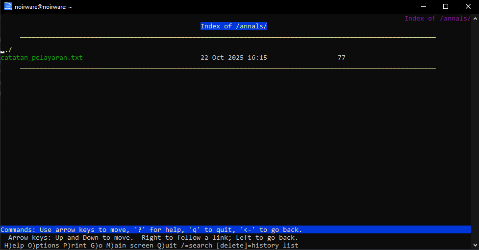

# Laporan Resmi Praktikum Jarkom Modul 2

| Nama Anggota | NRP |
|--------------|-----|
|Khumaidi Kharis A. | 5027241049|
|Nadia Fauziazahra K. | 5027241094|


## nomor 1

Pada soal ini kita perlu membuat topologi jaringan GNS3 sesuai dengan soal yang diberikan

## nomor 2

Selanjutnya kita perlu setting konfigurasi di router Eonwe agar bisa tersambung ke internet.

Eonwe

    auto eth0
    iface eth0 inet dhcp


## nomor 3

Pada nomor ini kita perlu konfigurasi untuk semua client agar bisa terhubung satu sama lain.

Eonwe

    auto eth0
    iface eth0 inet dhcp
    
    auto eth1
        iface eth1 inet static
        	address 192.235.1.1
        	netmask 255.255.255.0
        
        auto eth2
        iface eth2 inet static
        	address 192.235.2.1
        	netmask 255.255.255.0
        
        auto eth3
        iface eth3 inet static
        	address 192.235.3.1
        	netmask 255.255.255.0
    
    up apt update && apt install iptables -y
    up iptables -t nat -A POSTROUTING -o eth0 -j MASQUERADE -s 192.235.0.0/16
    
Earendil
    
    auto eth0
        iface eth0 inet static
        	address 192.235.1.2
        	netmask 255.255.255.0
        	gateway 192.235.1.1
    
    up echo nameserver 192.235.3.20 > /etc/resolv.conf
    up echo nameserver 192.235.3.21 >> /etc/resolv.conf
    up echo nameserver 192.168.122.1 >> /etc/resolv.conf
    
Elwing

    auto eth0
        iface eth0 inet static
        	address 192.235.1.3
        	netmask 255.255.255.0
        	gateway 192.235.1.1
    
    up echo nameserver 192.235.3.20 > /etc/resolv.conf
    up echo nameserver 192.235.3.21 >> /etc/resolv.conf
    up echo nameserver 192.168.122.1 >> /etc/resolv.conf
    
Cirdan

    auto eth0
    iface eth0 inet static
        address 192.235.2.2
        netmask 255.255.255.0
        gateway 192.235.2.1
    
    up echo nameserver 192.235.3.20 > /etc/resolv.conf
    up echo nameserver 192.235.3.21 >> /etc/resolv.conf
    up echo nameserver 192.168.122.1 >> /etc/resolv.conf
    
Elrond

    auto eth0
    iface eth0 inet static
        address 192.235.2.3
        netmask 255.255.255.0
        gateway 192.235.2.1
    
    up echo nameserver 192.235.3.20 > /etc/resolv.conf
    up echo nameserver 192.235.3.21 >> /etc/resolv.conf
    up echo nameserver 192.168.122.1 >> /etc/resolv.conf
    
Maglor

    auto eth0
    iface eth0 inet static
        address 192.235.2.4
        netmask 255.255.255.0
        gateway 192.235.2.1
    
    up echo nameserver 192.235.3.20 > /etc/resolv.conf
    up echo nameserver 192.235.3.21 >> /etc/resolv.conf
    up echo nameserver 192.168.122.1 >> /etc/resolv.conf
    
Sirion

    auto eth0
    iface eth0 inet static
        address 192.235.3.2
        netmask 255.255.255.0
        gateway 192.235.3.1
    
    up echo nameserver 192.235.3.20 > /etc/resolv.conf
    up echo nameserver 192.235.3.21 >> /etc/resolv.conf
    up echo nameserver 192.168.122.1 >> /etc/resolv.conf
    
Triton

    auto eth0
    iface eth0 inet static
        address 192.235.3.20
        netmask 255.255.255.0
        gateway 192.235.3.1
    
    up echo nameserver 127.0.0.1 > /etc/resolv.conf
    up echo nameserver 192.168.122.1 >> /etc/resolv.conf
    
Valmar

    auto eth0
    iface eth0 inet static
        address 192.235.3.21
        netmask 255.255.255.0
        gateway 192.235.3.1
    
    up echo nameserver 192.235.3.20 > /etc/resolv.conf
    up echo nameserver 127.0.0.1 >> /etc/resolv.conf
    up echo nameserver 192.168.122.1 >> /etc/resolv.conf
    
Lindon

    auto eth0
    iface eth0 inet static
        address 192.235.3.10
        netmask 255.255.255.0
        gateway 192.235.3.1
    
    up echo nameserver 192.235.3.20 > /etc/resolv.conf
    up echo nameserver 192.235.3.21 >> /etc/resolv.conf
    up echo nameserver 192.168.122.1 >> /etc/resolv.conf
    
Vingilot

    auto eth0
    iface eth0 inet static
        address 192.235.3.11
        netmask 255.255.255.0
        gateway 192.235.3.1
    
    up echo nameserver 192.235.3.20 > /etc/resolv.conf
    up echo nameserver 192.235.3.21 >> /etc/resolv.conf
    up echo nameserver 192.168.122.1 >> /etc/resolv.conf


## Nomor 4

Pada soal ini, kita diminta untuk membangun sistem DNS authoritative untuk domain K48.com dengan menggunakan dua server, yaitu Tirion (ns1/master) dan Valmar (ns2/slave).
Tujuan dari konfigurasi ini adalah agar domain K48.com dapat dikelola secara terpusat melalui server master, namun tetap memiliki cadangan (redundancy) melalui server slave apabila master mengalami gangguan. Selain itu, konfigurasi juga mencakup pengaturan resolver di setiap host agar dapat melakukan query DNS secara berurutan.

Tirion

    apt update && apt install bind9 -y
    apt install systemctl -y
    
    nano /etc/bind/named.conf.options
    options {
        directory "/var/cache/bind";
        forwarders {
            192.168.122.1;
        };
        allow-query{any;};
        listen-on { 192.235.3.20; 127.0.0.1; };
    };
    
    nano /etc/bind/named.conf.local
    zone "K48.com" {
        type master;
        file "/etc/bind/db.K48.com";
        allow-transfer { 192.235.3.21; };
        also-notify { 192.235.3.21; };
        notify yes; 
    };
    
    nano /etc/bind/db.K48.com
    $TTL    604800
    @       IN      SOA     ns1.K48.com. root.K48.com. (
                                  2025101301 ; Serial
                                  604800     ; Refresh
                                   86400     ; Retry
                                2419200      ; Expire
                                  604800 )   ; Negative Cache TTL
    
    @       IN      NS      ns1.K48.com.
    @       IN      NS      ns2.K48.com.
    
    ; A Record untuk Nameserver
    ns1     IN      A       192.235.3.20
    ns2     IN      A       192.235.3.21
    
    ; A Record Apex (Front Door)
    @       IN      A       192.235.3.22
    
cek di Tirion

    named-checkzone K48.com /etc/bind/db.K48.com
    systemctl restart bind9
    systemctl status bind9
    
    
Valmar

    apt update && apt install bind9 -y
    apt install systemctl -y
    
    nano /etc/bind/named.conf.options
    options {
        directory "/var/cache/bind";
        forwarders {
            192.168.122.1;
        };
        allow-query{any;};
        listen-on { 192.235.3.21; 127.0.0.1; };
    };
    
    nano /etc/bind/named.conf.local
    zone "K48.com" {
        type slave;
        file "var/lib/bind/db.K48.com";
        masters { 192.235.3.20; }; 
    };
    
    systemctl restart bind9
    systemctl status bind9

Cek di Valmar

    dig @127.0.0.1 K48.com

Cek di client

    sudo apt update 
    dig ns1.K48.com
    dig ns2.K48.com
    dig google.com 


## Nomor 5

Pada soal ini, kita diminta untuk memberi nama (hostname) pada seluruh node yang ada di jaringan sesuai dengan glosarium, yaitu:
eonwe, earendil, elwing, cirdan, elrond, maglor, sirion, tirion, valmar, lindon, dan vingilot.
Selain itu, kita juga harus memastikan bahwa setiap host mengenali dan menggunakan hostname tersebut secara system-wide, artinya nama-nama tersebut dikenali oleh sistem di seluruh node tanpa perlu menggunakan IP secara langsung.

Tugas ini juga mengharuskan kami untuk membuat domain untuk masing-masing node sesuai dengan nama hostnya dalam bentuk Eonwe.K48.com, serta meng-assign alamat IP untuk tiap node. Pengecualian diberikan untuk host yang berperan sebagai ns1 dan ns2, karena sudah diatur sebelumnya dalam konfigurasi DNS master–slave.

Tirion

    nano /etc/bind/db.K48.com
    
tambahkan/perbarui sesuai config berikut
    
    $TTL    604800
    @       IN      SOA     ns1.K48.com. root.K48.com. (
                                  2025101302 ; Serial 
                                  604800     ; Refresh
                                   86400     ; Retry
                                2419200      ; Expire
                                  604800 )   ; Negative Cache TTL
    
    @       IN      NS      ns1.K48.com.
    @       IN      NS      ns2.K48.com.
    
    ; A Record untuk Nameserver
    ns1     IN      A       192.235.3.20
    ns2     IN      A       192.235.3.21
    
    ; A Record Apex (Front Door)
    @       IN      A       192.235.3.22
    eonwe       IN  A   192.235.3.1
    earendil    IN  A   192.235.1.2
    elwing      IN  A   192.235.1.3
    cirdan      IN  A   192.235.2.2
    elrond      IN  A   192.235.2.3
    maglor      IN  A   192.235.2.4
    lindon      IN  A   192.235.3.23
    vingilot    IN  A   192.235.3.24
    
Test di tirion

    named-checkzone K48.com /etc/bind/db.K48.com
    named-checkconf
    systemctl restart bind9
    systemctl status bind9
    
Di terminal valmar
    
    systemctl restart bind9
    systemctl status bind9
    
testing di tirion

    dig @127.0.0.1 K48.com
    dig @127.0.0.1 eonwe.K48.com
    
testing di Valmar/ns

    dig @127.0.0.1 K48.com
    
testing di client

    dig K48.com
    dig eonwe.K48.com
    dig google.com


## Nomor 6

Pada soal ini, kita diminta untuk memastikan bahwa proses zone transfer antara Tirion (ns1) sebagai DNS master dan Valmar (ns2) sebagai DNS slave berjalan dengan baik.
Tujuan dari langkah ini adalah agar Valmar dapat menerima salinan (copy) zona terbaru dari Tirion secara otomatis setiap kali terjadi perubahan pada data zona K48.com.

Selain itu, kita juga perlu memverifikasi bahwa nilai serial number pada record SOA (Start of Authority) di kedua server, yaitu di Tirion dan Valmar, harus sama. Kesamaan nilai serial ini menunjukkan bahwa zone transfer berhasil dan data DNS di antara kedua server telah sinkron (up to date).

Terminal Tirion
    
    dig @192.235.3.20 k48.com SOA
    
Terminal valmar

    ls -l /var/lib/bind #cek ada file db.K48.com

Testing

    dig @192.235.3.21 k48.com SOA
    
cocokan answer section for SOA

untuk lacak log Valmar
```
apt update && apt install journalctl -y
journalctl -xeu bind9 | grep transfer
```
Verifikasi akhir di Valmar
```
dig @127.0.0.1 K48.com
dig @127.0.0.1 eonwe.K48.com
```


## Nomor 7

Pada soal ini, kita diminta untuk menambahkan entri A record dan CNAME pada zona K48.com untuk menggambarkan hubungan antar host yang berfungsi sebagai gerbang dan layanan web dalam jaringan.

Dalam konfigurasi ini, Sirion berperan sebagai gerbang utama (front door), Lindon sebagai server web statis, dan Vingilot sebagai server web dinamis.
Saya perlu menambahkan A record untuk masing-masing host, yaitu:

sirion.K48.com yang mengarah ke IP milik Sirion,

lindon.K48.com yang mengarah ke IP milik Lindon, dan

vingilot.K48.com yang mengarah ke IP milik Vingilot.

Selain itu, kita juga harus menambahkan CNAME record (alias) agar:

www.K48.com mengarah ke sirion.K48.com,

static.K48.com mengarah ke lindon.K48.com, dan

app.K48.com mengarah ke vingilot.K48.com.

Langkah terakhir adalah melakukan verifikasi dari dua klien yang berbeda untuk memastikan bahwa seluruh hostname tersebut dapat ter-resolve dengan benar dan konsisten, baik melalui DNS master maupun slave.

Terminal Tirion
    
    nano /etc/bind/db.k48.com
    
tambahkan
    
    ; A Records for Servers
    sirion      IN      A       192.235.3.2
    lindon      IN      A       192.235.3.10
    vingilot    IN      A       192.235.3.11
    
    ; CNAME Aliases
    www         IN      CNAME   sirion.k48.com.
    static      IN      CNAME   lindon.k48.com.
    app         IN      CNAME   vingilot.k48.com.

ubah serial dari 2025101301 menjadi 2025101302 

Lanjut di Tirion
    
    systemctl restart bind9
    
Test pada dua klien berbeda

    host www.k48.com
    host static.k48.com
    host app.k48.com

hasil harus konsisten 


## Nomor 8

Pada soal ini, kita diminta untuk membuat dan mengonfigurasi reverse DNS zone di server Tirion (ns1) untuk segmen DMZ, yaitu segmen jaringan tempat tiga host utama (Sirion, Lindon, dan Vingilot). Selain itu, saya juga perlu memastikan bahwa Valmar (ns2) sebagai DNS slave dapat menarik (zone transfer) reverse zone tersebut dari Tirion, sehingga Valmar memiliki salinan terbaru dari zona DMZ secara otomatis.

Sebagai tahap akhir, kita harus memverifikasi bahwa query reverse lookup untuk ketiga alamat IP tersebut dijawab secara authoritative oleh server DNS, baik dari Tirion maupun Valmar, yang menandakan bahwa konfigurasi reverse DNS sudah berjalan dengan benar dan sinkron.


Terminal Tirion

    nano /etc/bind/named.conf.local

Tambahkan blok ini di bawah konfigurasi zone "k48.com" Anda

    zone "3.235.192.in-addr.arpa" {
    type master;
    file "/etc/bind/db.192.235.3";   // Ini adalah file BARU yang akan kita buat
    allow-transfer { 192.235.3.21; };   // Izinkan Valmar menyalin
    also-notify { 192.235.3.21; };      // Beri tahu Valmar jika ada update
    };

Buka file db

    nano /etc/bind/db.192.235.3

isi code berikut

    $TTL    604800
    @       IN      SOA     tirion.k48.com. root.k48.com. (
                          2025101303     ; Serial (PENTING: Naikkan angkanya!)
                          604800         ; Refresh
                          86400          ; Retry
                          2419200        ; Expire
                          604800 )       ; Negative Cache TTL
    ;
    ; Name Server Record
    @       IN      NS      tirion.k48.com.
    
    ; --- Pointer (PTR) Records ---
    ; [Oktet terakhir IP]   IN PTR   [Hostname.]
    2       IN      PTR     sirion.k48.com.
    10      IN      PTR     lindon.k48.com.
    11      IN      PTR     vingilot.k48.com.

Restart bind9

    service bind9 restart

Terminal Valmar

    nano /etc/bind/named.conf.local

Tambahkan blok ini di Valmar

    zone "3.235.192.in-addr.arpa" {
        type slave;
        masters { 192.235.3.20; }; // Tentukan IP master (Tirion)
        file "/var/lib/bind/db.192.235.3";
    };
    
    service bind9 restart

cek di client (ex Earendil)

    # Cek IP Sirion
    host 192.235.3.2
    # Cek IP Lindon
    host 192.235.3.10
    # Cek IP Vingilot
    host 192.235.3.11


## Nomor 9

Pada soal ini, kita diminta untuk menjalankan layanan web statis pada hostname static.K48.com yang dihosting di Lindon. Web ini harus menyediakan akses ke folder /annals/ dengan fitur autoindex (directory listing) agar isi folder dapat ditelusuri langsung melalui browser.

Selain itu, akses ke web harus dilakukan melalui hostname static.K48.com, bukan menggunakan alamat IP, sehingga konfigurasi DNS dan virtual host harus sudah mendukung resolusi nama tersebut.


Akses di client Lindon

    apt-get update -y
    apt-get install -y nginx

    mkdir -p /var/www/static/annals

    cat > /var/www/static/index.html << 'HTML'
    <!doctype html>
    <title>Lampion Lindon</title>
    <h1>Selamat Datang di Pelabuhan Statis Lindon</h1>
    <p>Akses <a href="/annals/">/annals/</a> untuk melihat arsip.</p>
    HTML
    
    cat > /var/www/static/annals/catatan_pelayaran.txt << 'TXT'
    Ini adalah arsip dari Pelabuhan Lindon.
    Directory listing (autoindex) aktif.
    TXT
    
    cat > /etc/nginx/sites-available/static.conf << 'NGINX'
    server {
        listen 80;
        server_name static.k48.com;
        root /var/www/static;
        index index.html;
    
        location /annals/ {
            autoindex on;
        }
    }
    NGINX

Membuat symbolic link untuk mengaktifkan situs

    ln -sf /etc/nginx/sites-available/static.conf /etc/nginx/sites-enabled/static.conf

Menghapus konfigurasi default jika ada

    rm -f /etc/nginx/sites-enabled/default

Memeriksa sintaks konfigurasi

    nginx -t

Memulai ulang layanan Nginx

    service nginx restart

Testing di client (ex Earendil)

    apt update && apt install lynx -y
    lynx http://static.k48.com
    lynx http://static.k48.com/annals/




## Nomor 10

Pada soal ini, kita diminta untuk menjalankan layanan web dinamis berbasis PHP-FPM pada hostname app.K48.com yang dihosting di Vingilot. Web ini harus memiliki halaman beranda (index.php) dan halaman about (about.php), serta menerapkan URL rewrite agar halaman /about dapat diakses tanpa perlu menuliskan akhiran .php.

Selain itu, seluruh akses ke situs harus dilakukan melalui hostname app.K48.com, bukan menggunakan alamat IP, sehingga konfigurasi DNS dan virtual host harus mendukung resolusi nama tersebut sepenuhnya.

Akses melalui Vingilot

    apt-get update -y
    apt-get install -y nginx php8.4-fpm

Membuat direktori root untuk web

    mkdir -p /var/www/app

Membuat file index.php (beranda)

    cat > /var/www/app/index.php <<'PHP'
    <?php
    echo "<h1>Vingilot Mengarungi Samudera Digital!</h1>";
    echo "<p>Ini adalah halaman utama yang dinamis.</p>";
    ?>
    PHP

Membuat file about.php (halaman tentang)

    cat > /var/www/app/about.php <<'PHP'
    <?php
    echo "<h2>Kisah Sang Navigator, Vingilot</h2>";
    echo "<p>Halaman ini diakses melalui rewrite URL.</p>";
    ?>
    PHP

    cat > /etc/nginx/sites-available/app.conf <<'NGINX'
        server {
            listen 80;
            server_name app.k48.com;
        
            root /var/www/app;
            index index.php;
    
        # Blok untuk URL rewrite /about
        location = /about {
            return 301 /about/; # Menambahkan trailing slash
        }
        location = /about/ {
            rewrite ^ /about.php last; # Menyajikan about.php tanpa mengubah URL
        }
    
        # Aturan umum untuk file dan direktori
        location / {
            try_files $uri $uri/ /index.php?$args;
        }
    
        # Meneruskan semua file .php ke PHP-FPM untuk diproses
        location ~ \.php$ {
            include snippets/fastcgi-php.conf;
            fastcgi_pass unix:/run/php/php8.4-fpm.sock; # Jembatan ke PHP
        }
    }
    NGINX

Mengaktifkan situs baru

    ln -sf /etc/nginx/sites-available/app.conf /etc/nginx/sites-enabled/app.conf

Menghapus konfigurasi default
    
    rm -f /etc/nginx/sites-enabled/default

Memeriksa sintaks konfigurasi

    nginx -t

Memulai ulang layanan PHP-FPM dan Nginx

    service php8.4-fpm start || service php-fpm start
    service nginx restart

Verifikasi di client(ex Earendil)

    lynx http://app.k48.com
    lynx http://app.k48.com/about


# Nomor 11

Pada soal ini, kami diminta untuk mengonfigurasi Sirion sebagai reverse proxy yang berfungsi sebagai gerbang utama (front door) bagi domain. Sirion harus menerapkan path-based routing, di mana:

Akses ke /static diteruskan ke Lindon (web statis), dan

Akses ke /app diteruskan ke Vingilot (web dinamis).

Selain itu, proxy harus meneruskan header Host dan X-Real-IP ke backend agar server di belakangnya tetap menerima informasi asli dari klien.

Sirion juga harus dapat menerima permintaan melalui dua hostname, yaitu www.K48.com (kanonik) dan sirion.K48.com, serta memastikan bahwa setiap permintaan ke /static dan /app benar-benar diteruskan dan disajikan oleh backend yang sesuai.


Akses melalui Sirion

    apt-get update -y
    apt-get install -y nginx

    echo "192.235.3.10 lindon.k48.com" >> /etc/hosts
    echo "192.235.3.11 vingilot.k48.com" >> /etc/hosts

    cat > /etc/nginx/sites-available/reverse-proxy.conf <<'NGINX'
    server {
        listen 80;
        # Menerima permintaan untuk kedua hostname
        server_name www.k48.com sirion.k48.com;
    
        # Aturan untuk /static/
        location /static/ {
            # Teruskan permintaan ke Lindon
            proxy_pass http://lindon.k48.com/;
    
            # Meneruskan header asli dari klien
            proxy_set_header Host $host;
            proxy_set_header X-Real-IP $remote_addr;
            proxy_set_header X-Forwarded-For $proxy_add_x_forwarded_for;
        }
    
        # Aturan untuk /app/
        location /app/ {
            # Teruskan permintaan ke Vingilot
            proxy_pass http://vingilot.k48.com/;
    
            # Meneruskan header asli dari klien
            proxy_set_header Host $host;
            proxy_set_header X-Real-IP $remote_addr;
            proxy_set_header X-Forwarded-For $proxy_add_x_forwarded_for;
        }
    }
    NGINX

Mengaktifkan situs reverse proxy

    ln -sf /etc/nginx/sites-available/reverse-proxy.conf /etc/nginx/sites-enabled/reverse-proxy.conf

Menghapus konfigurasi default

    rm -f /etc/nginx/sites-enabled/default

Memeriksa sintaks konfigurasi

    nginx -t

Memulai ulang layanan Nginx

    service nginx restart

Verifikasi di client (ex Earendil)

    lynx http://www.k48.com/static/
    lynx http://www.k48.com/app/


